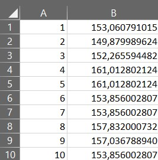
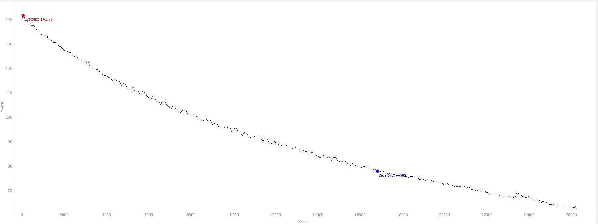

Gaussian Filter Application

This repository contains a Python application that applies a Gaussian filter to input data using the SciPy library. Smooths input data using a Gaussian filter from the SciPy library. The application has been compiled into an executable using Nuitka for improved performance and distribution.

How Works

A Gaussian filter is a type of linear smoothing filter used in image processing and signal processing. It is named after the Gaussian function, which describes the bell-shaped curve. The main purpose of a Gaussian filter is to reduce noise and detail in an image or signal, effectively performing a blurring operation. The Gaussian Smoothing Operator performs a weighted average of surrounding pixels based on the Gaussian distribution. This operator uses the Gaussian function: 

where 
𝑥 and 𝑦 are the coordinates of the pixel, and 𝜎 is the standard deviation of the Gaussian distribution. The value of 𝜎 defines the amount of blurring: a larger 𝜎 results in more blurring. 

 image from https://stackoverflow.com/questions/23007064/effect-of-variance-sigma-at-gaussian-smoothing
x is the distance from the origin
σ is the standard deviation of the Gaussian distribution.

This application using library from scipy, which can import by from scipy.ndimage import gaussian_filter1d. The gaussian_filter1d function from the scipy.ndimage module is used to apply a one-dimensional Gaussian filter to an input array. This function is particularly useful for smoothing data by reducing noise while preserving important features like peaks. The effect of applying this filter is that data points close to the center have higher weights, and those farther away have exponentially decreasing weights. This creates a smoothing effect that reduces high-frequency noise. In this application, gaussian_filter1d is used to smooth the data before detecting peaks for systolic and diastolic pressures. Here’s how it’s used:
# Apply Gaussian filter to smooth the data
sigma = float(self.entry_window_size.text())  # Get sigma value from the QLineEdit
y_smoothed = gaussian_filter1d(y_data, sigma=sigma)

Extract Sigma Value:

The sigma value (standard deviation) is extracted from a text input field (self.entry_window_size.text()). This value determines the extent of the smoothing. A larger sigma results in more smoothing, while a smaller sigma preserves more detail but reduces noise less effectively.

Apply Gaussian Filter:

The gaussian_filter1d function is called with the raw data (y_data) and the specified sigma value.
The function returns a new array (y_smoothed) that contains the smoothed data.

Here the example:

import numpy as np
from scipy.ndimage import gaussian_filter1d
import matplotlib.pyplot as plt

# Create a noisy signal
x = np.linspace(0, 10, 100)
y = np.sin(x) + np.random.normal(0, 0.5, x.shape)

# Apply Gaussian filter with different sigma values
y_smoothed_1 = gaussian_filter1d(y, sigma=1)
y_smoothed_2 = gaussian_filter1d(y, sigma=3)
y_smoothed_3 = gaussian_filter1d(y, sigma=5)

# Plot the original and smoothed signals
plt.figure(figsize=(10, 6))
plt.plot(x, y, label='Noisy Signal', color='gray', linestyle='--')
plt.plot(x, y_smoothed_1, label='Smoothed (sigma=1)', color='blue')
plt.plot(x, y_smoothed_2, label='Smoothed (sigma=3)', color='green')
plt.plot(x, y_smoothed_3, label='Smoothed (sigma=5)', color='red')
plt.legend()
plt.xlabel('X')
plt.ylabel('Y')
plt.title('Gaussian Smoothing with Different Sigma Values')
plt.show() 

Usage

Run file GF1.1.exe and browse file using format 

Then click process and plot, here the sample for averaging data blood pressure 

**The detection of systolic and diastolic pressure remains imprecise and requires further enhancements to better handle data variations and achieve more reliable blood pressure readings. Currently, this program primarily excels at data smoothing.**

Contributing

We welcome contributions to enhance the functionality and accuracy of this project.

Installation

Just extract zip and run GF1.1exe <a href="https://github.com/mhbkrn/Gaussian-Filter/releases/download/GF/Averaging.Data.zip">Averaging Data</a> 

Contact

For questions or support, please open an issue or contact the project maintainer at [muhammadhabibkurnianto@gmail.com].
